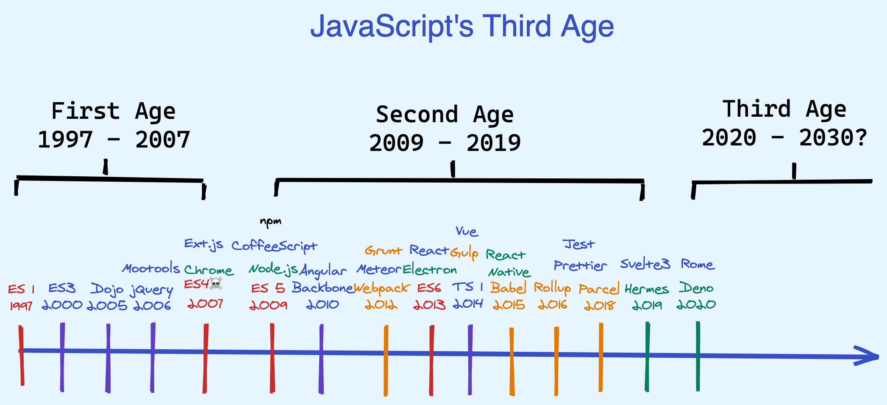
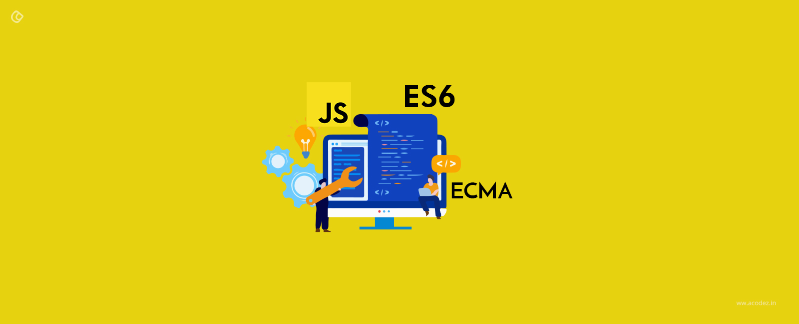

# JavaScript简介 😊

### 什么是JavaScript？

​		JavaScript是一种运行在浏览器中的解释型的编程语言。

> ​		JavaScript在1995年由[Netscape](https://baike.baidu.com/item/Netscape/2778944)公司的Brendan Eich，在网景导航者浏览器上首次设计实现而成。因为		Netscape与[Sun](https://baike.baidu.com/item/Sun/69463)合作，Netscape管理层希望它外观看起来像Java，因此取名为JavaScript。但实际上它的语法风格与[Self](https://baike.baidu.com/item/Self/4959923)及[Scheme](https://baike.baidu.com/item/Scheme/8379129)较为接近。

------

### JavaScript和ECMAScript的关系

​	ECMAScript：根据MCMA-262标准，实现的通用脚本语言规范。

​	Javascript：通用的跨平台脚本语言，遵守ECMA262的标准。

### 为什么要学JavaScript？

​		在web的世界里，只有JavaScript能实现跨平台、跨浏览器驱动网页，与用户进行交互。

### 如何学习JavaScript？🤔️

​		三个方面：

​				1、ECMAScript（语言核心功能）

​				2、DOM  js需要支持对DOM的维护，通过document，element对象实现

​				3、BOM  js需要支持对BOM的维护，通过window对象实现

> JavaScript一度被认为是一种玩具编程语言，它有很多缺陷，所以不被大多数后端开发人员所重视。很多人认为，写JavaScript代码很简单，并且JavaScript只是为了在网页上添加一点交互和动画效果。

------

### 推荐阅读：

> ##### [学习Django😀](https://github.com/epover/LearnDjango)
>
> ##### [学习Git和GitHub🤩](https://github.com/epover/Learn_GitHub)
>
> ##### [学习WebService😍](https://github.com/epover/WebService) 
>
> ##### **[Angular团队提交规范👍](https://github.com/angular/angular.js/blob/master/DEVELOPERS.md#-git-commit-guidelines)**

